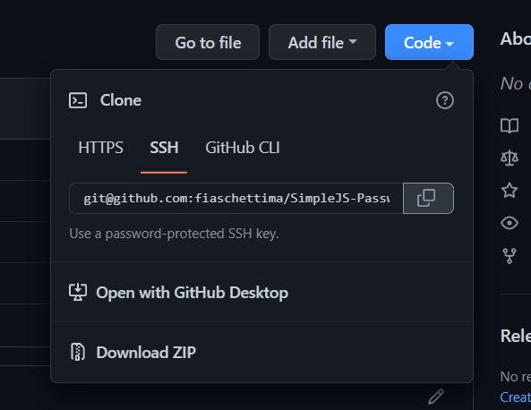
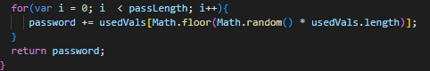

# SimpleJS-Password-Gen

## Description

In this project a random password generator was created. Using the generator you can decide what types of characters can be used and the length of the password.
    
[Link to the Live webpage](https://fiaschettima.github.io/SimpleJS-Password-Gen/)

---
## Table of Contents

Here's a few quick links:

* [Installation](#installation)
* [Code Snippets](#code-snippets)
* [Usage](#usage)
* [Credits](#credits)
* [License](#license)
---

## Installation

To download the raw code of the page follow the steps below:
1. In the SimpleJS-Password-Gen Repository copy the Code  
2. Open your version of terminal and enter > git clone git@github.com:fiaschettima/SimpleJS-Password_Gen (Just paste the code you copied from previous step)
3. After that the code is now on your local machine and you are free to copy it to your own repository and make changes
---

## Code Snippets

This section of code is using Math floor and random to pick a random location in the array. Math random chooses a random number between 0 and 1 then that is mulitplied by array length
and rounded down by math floor. Doing this will pick any position inside the array. The counter i being used will repeat this process until it gets to the value of password length the user entered.

---
## Usage 

Generate Unique secure passwords quickly

## Credits

- [W3 Scools](https://www.w3schools.com/)

---
## License

MIT License